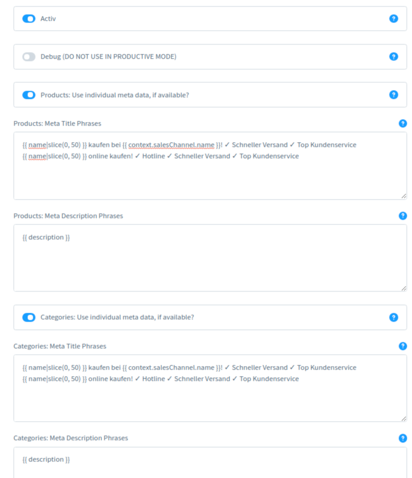

# SW6 Generate SEO meta data automatically
Shopware 6 Plugin: Automatically generate SEO meta data for products and categories according to your own scheme. Language and sub-shop compatible. Increase the visibility of your online shop!

For search engine optimization it is essential that you have optimized meta information for category and product pages. This plugin helps you to insert an optimized meta title and meta description with the help of templates (phrases). It is possible to use several templates (see below).

The phrases can be maintained completely individually per storefront and language.



## Shopware 6 Version
Tested with 6.1.3 and 6.1.4

## Structure of the templates for SEO meta data (phrases)
The structure of the SEO meta information can be completely individual. In addition to fixed text, variable information such as the product name can also be used. You can access almost all information of the current category or product.

Because the templates are rendered as Twig-Templates, you have a lot of possibilities to specify the meta information individually.

For example, a template could look like this:
```{{ name|slice(0, 50) }} buy from {{{ context.salesChannel.name }}! ✓ Fast shipping ✓ Top customer service```

## Multiple templates
It is possible to store several templates for categories and products. The respective template is selected automatically. For a product/category, always the same template is selected. The template changes only if the number of templates is changed.

## Installation
1. install the plugin as usual
2. clear cache: ```./bin/console cache:clear```
3. configure the plugin: Settings > System > Plugins > Click on the three dashes of the plugin > Config
4. after changing settings, the cache must be cleared: ```./bin/console cache:clear```

## Twig Template Phrases
The following blocks can be used as examples. Using the respective category and product object (```{{ category }}``` or ```{{ page.product }}```) almost all information can be read out.

For problems with special characters I recommend to use the ```raw``` function of Twig:
https://twig.symfony.com/doc/2.x/filters/raw.html

### In general:
- Shop Name ```{{ context.salesChannel.name }}```
- System Config ```{{ shopware.config.core.basicInformation.shopName }}```
- Snippets ```{{ "detail.addProduct"|trans|sw_sanitize }}```
- Use of Twig functions possible ```{{ name|slice(0, 10) }}```

### Products:
- Name ```{{ name }}```
- Description ```{{ description }}```
- Item number ```{{ page.product.productnumber }}```
- EAN ```{{ page.product.ean}}```
- manufacturer ```{{ page.product.manufacturer.translated.name }}```
- Stock ```{{ page.product.stock }}``` ```{{ page.product.availableStock }
- Rating as number (1-5) ```{{ page.product.ratingAverage }}```
- Attributes ```{{ page.product.customFields.custom_shoes_quos_earum_non }}```
- Options ```{{ option.group.translated.name|e }}} {{{ option.translated.name|e }}```
- price ```{{ price }}```
- For experienced users: Product Object: ```{{ page.product }}``` and Context Object: ```{{ context }}```

### Categories:
- Name ```{{ name }}```
- Description ```{{ description }}```
- For experienced users: Category Object: ```{{ category }}``` and context Object: ```{{ context }}```

## Translations
If the differentiation between individual storefronts is no longer sufficient, phrases can also be stored specifically for individual languages.
You only need to specify the ISO code (for example, de-DE) at the beginning of the line.
Note: Phrases without ISO code are used for all languages.

```de-DE:{{ name|slice(0, 50) }} buy from {{{ context.salesChannel.name }}! ✓ Fast shipping ✓ Top customer service```

```en-GB:{{ name|slice(0, 50) }} buy from {{{ context.salesChannel.name }}! ✓ Fast shipping ✓ Top customer service```  

## License
Using for private and commercial: Free
Copy parts of the code: Allowed
Modify: Allowed
Reselling: Not allowed